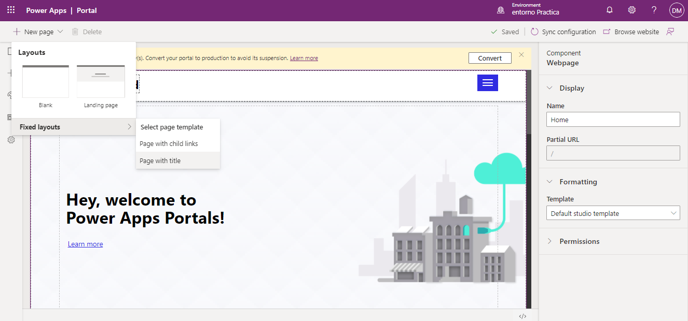
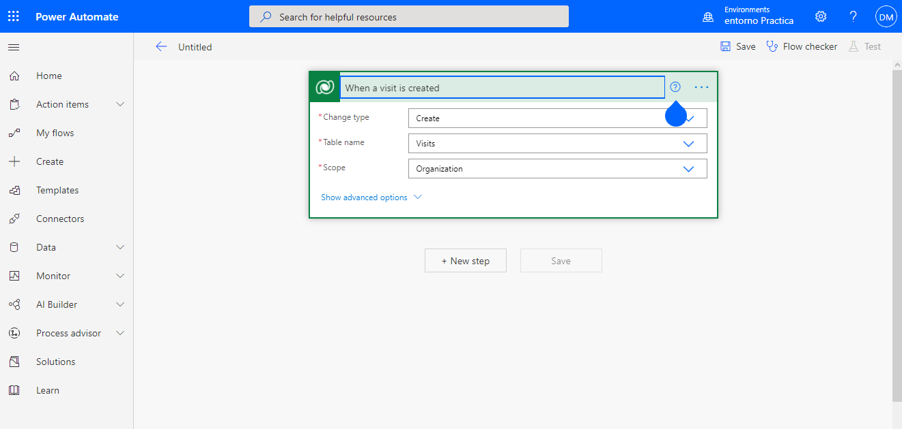
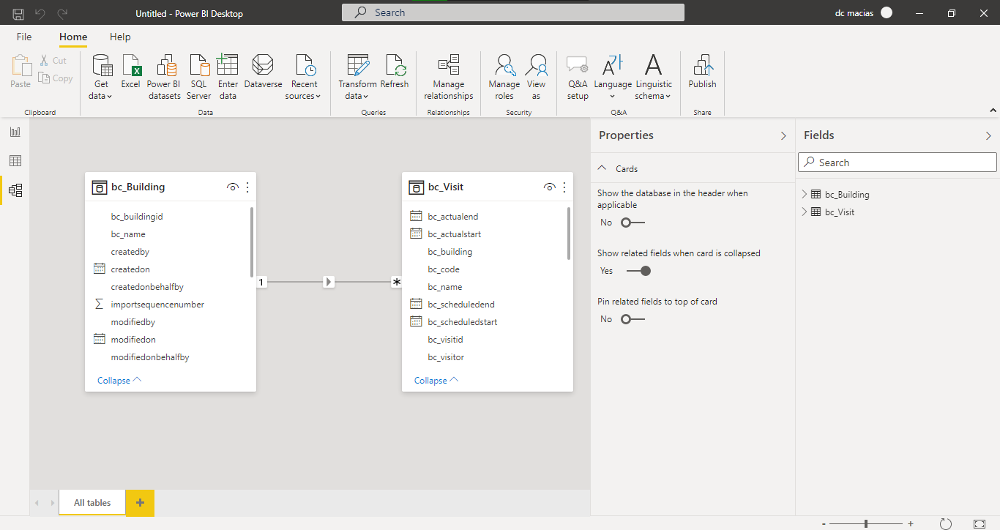

Module 0: Course introduction
=================================

## Lab: Validate lab environment

# Module 2: Introduction to Microsoft Dataverse

## Lab: Data Modeling

# Module 3: Get started with Power Apps

## Lab1: How to build a canvas app, Part 1

# Module 3: Get started with Power Apps

## Lab 2: How to build a canvas app, part 2

 

# Module 3: Get started with Power Apps

## Lab 3: How to build a model-driven app 

# Module 3: Get started with Power Apps

## Lab 4: How to build a Power Apps portal

# Module 4: Get Started with Power Automate

## Lab: How to build an automated solution

# Module 5: Get Started with Power BI

## Lab: How to build a simple dashboard

# Module 6: Intro to Power Virtual Agents

## Lab: How to build a basic chatbot

